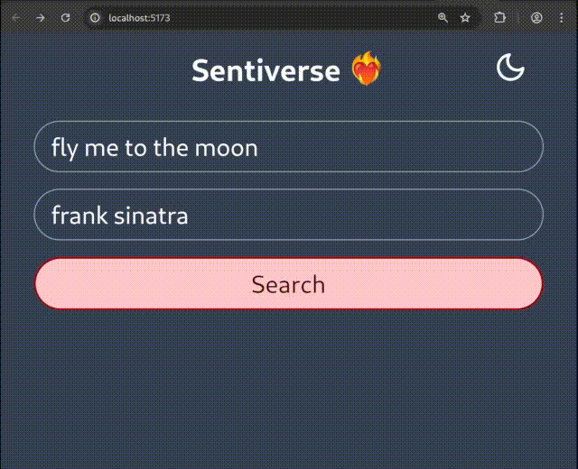

# Sentiverse ❤️‍🔥

## A full-stack web application for analyzing the emotional landscape of your favorite song lyrics



> Sentiverse searches for your favorite songs on [Genius](https://genius.com), retrieves the lyrics, and classifies them based on emotionally opposite word pairs

Its core aim is to enhance the way we connect with music by revealing at a glance the underlying emotions that resonate within the lyrics

## How it works

1) The user submits a song and artist query to the API
2) A list of matching results is returned by the API
3) The user selects the matching song
4) The API scrapes the lyrics from the Genius website
5) The lyrics are cleaned and preprocessed
6) OpenAI's ChatGPT then classifies the lyrics according to a set of clear, predefined instructions.
7) The scores for each pair sum up to 1.0, which are displayed in the frontend as a stacked bar chart

---

## Core Technologies

### Backend

- [Python](https://www.python.org/)
- [FastAPI](https://fastapi.tiangolo.com)
- [GraphQL](https://graphql.org)
- [Strawberry](https://strawberry.rocks)
- [BeautifulSoup](https://beautiful-soup-4.readthedocs.io)
- [OpenAI](https://openai.com/)

### Frontend

- [Typescript](https://www.typescriptlang.org/)
- [React](https://react.dev)
- [Tailwind CSS](https://tailwindcss.com/)
- [Apollo](https://www.apollographql.com/)
- [Vite](https://vite.dev/)
- [npm](https://www.npmjs.com/)

### DevOps

- [Nginx](https://nginx.org/)
- [Uvicorn](https://www.uvicorn.org/)
- [Docker](https://www.docker.com/)
- [Google Cloud](https://console.cloud.google.com/)

---

## Local Setup

### Pre-requisites

- [Python](https://www.python.org/downloads/)
- [Node.js](https://nodejs.org/en)

### 1. Obtain a Genius API key from [here](https://genius.com/api-clients) and an OpenAI key from [here](https://openai.com/api/)

### 2. Clone the repository

```sh
git clone https://github.com/saragarcia6123/Sentiverse.git
cd Sentiverse
```

### 3. Create a .env file in `backend` and set your API keys

```sh
cd backend
touch .env
echo GENIUS_ACCESS_TOKEN=your_access_token >> .env
echo OPENAI_API_KEY=your_api_key >> .env
```

### 4a. Start the backend

```sh
fastapi dev src/app.py
```

### 4b. Start the frontend

```sh
cd ../frontend
npm run dev
```

### Open your browser and navigate to <http://localhost:5173>

### Authors

- [Sara Garcia](https://github.com/saragarcia6123)
